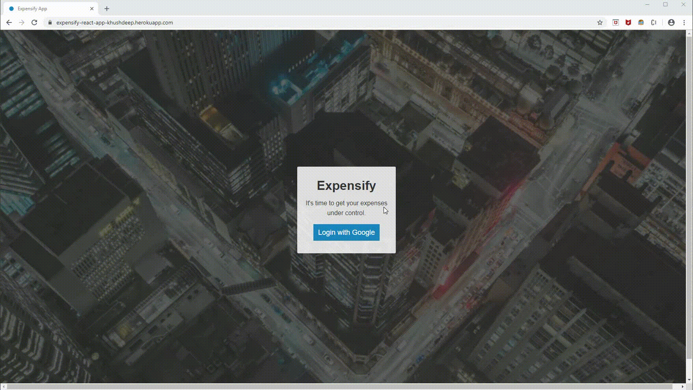
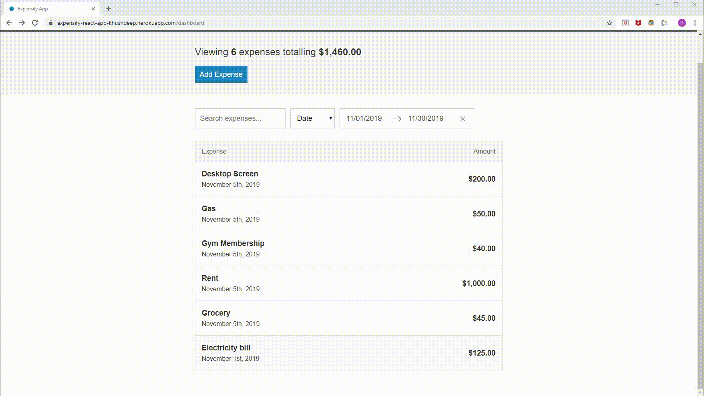
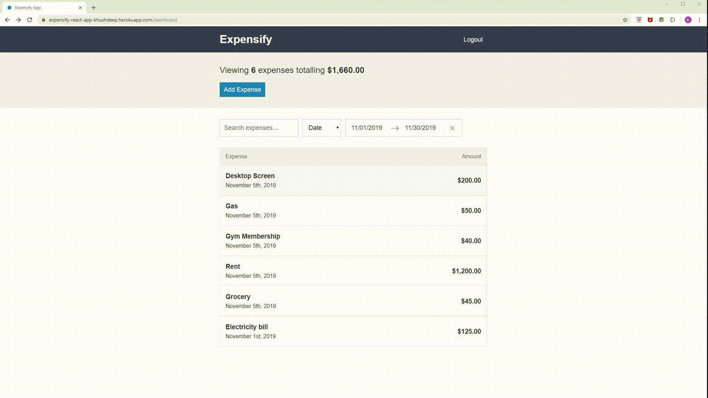
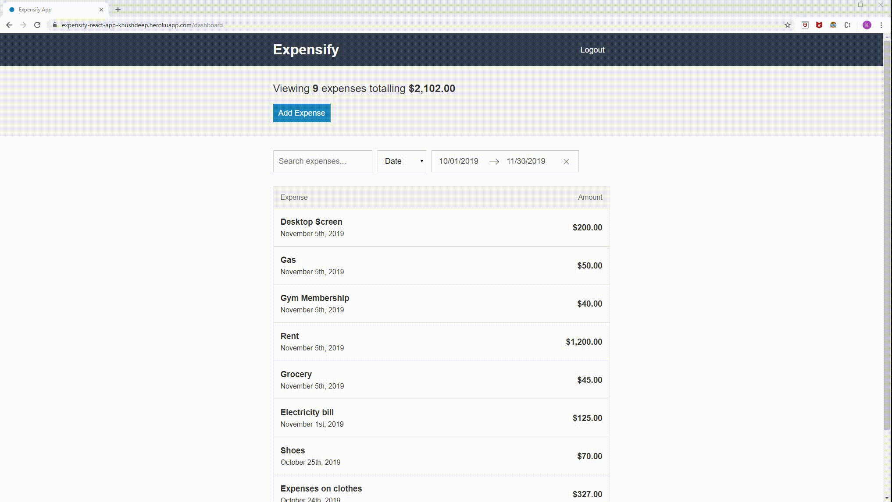
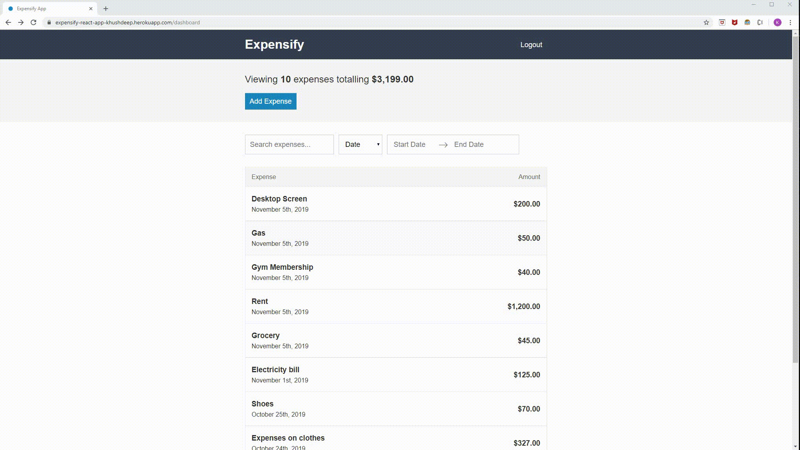
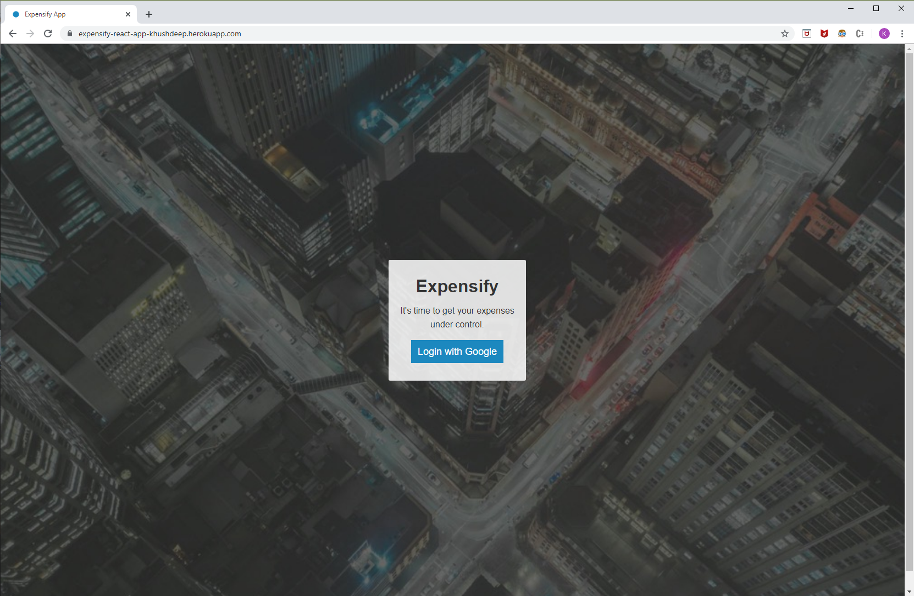
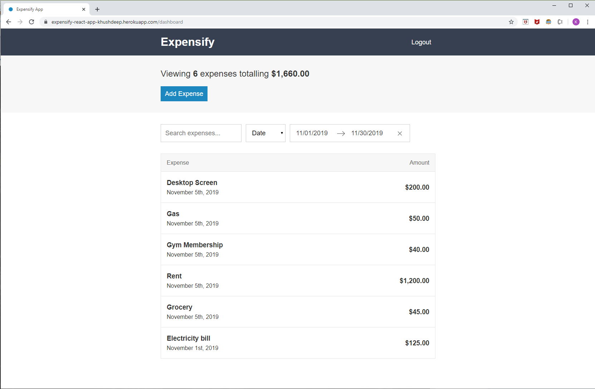
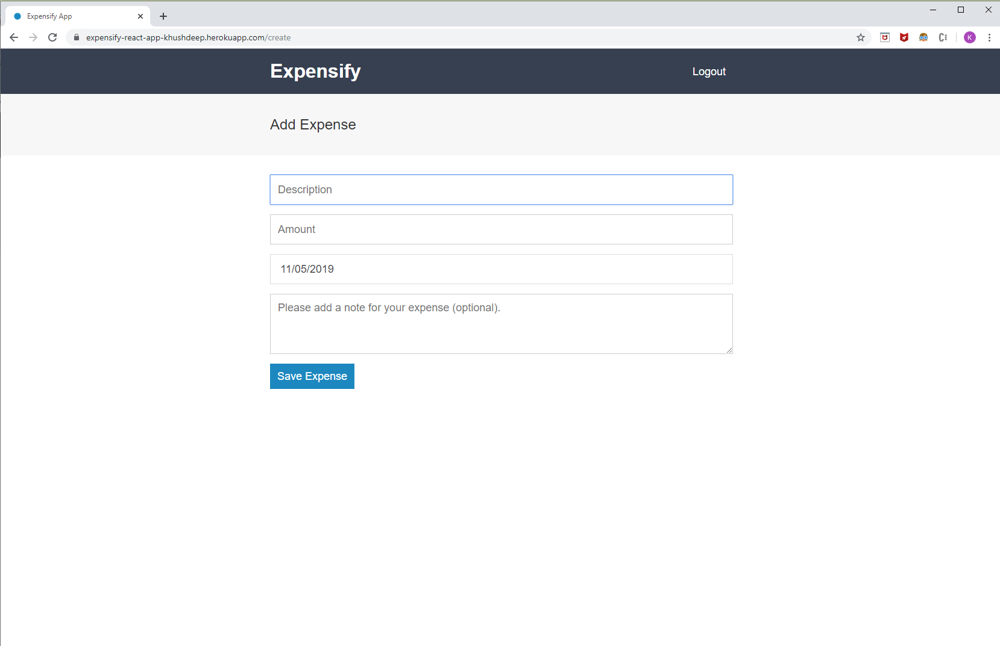
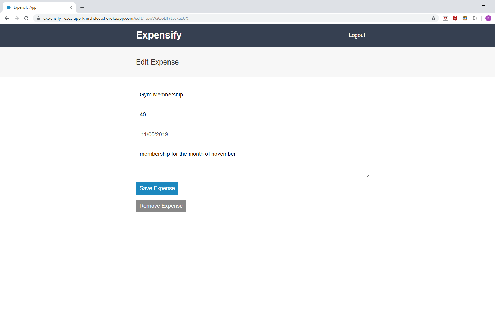

# React Redux Expenses Tracker

An expense tracker project for real-world-business based on React 16.8, React-Redux and Sass.

The goal of this project is to allow the user to create and track their expenses and have control over their spending.

## Features

* This project is built on top of React/Redux.
* Firebase database is used to store the user expenses.
* Google Authentication is used to securely login users.
* This project uses Redux-Thunk to perform async actions for database queries to Create, Read, Update and Delete expenses.

## Live Demo

### Login and Add Expense - 



### Edit Expense 



### Filter expenses by date range



### Filter expenses by text



### Sort-expenses-by-date-or-amount



## Screenshots

### Login Page



### Expense Dashboard Page



### Add Expense Page



### Edit Expense Page



## Build Setup

```
# Clone project
git clone https://github.com/KhushdeepSidhu/expensify-react-app.git

# install the packages with npm or yarn
cd expensify-react-app
npm install 
# or yarn 
yarn install 

## development
npm run dev-server
# or yarn
yarn dev-server

## build for dev
npm run build:dev
# or yarn
yarn run build:dev

## build for production
npm run build:prod
# or yarn
yarn run build:prod

## Run automated unit tests
npm run test
# or yarn
yarn run test
```
